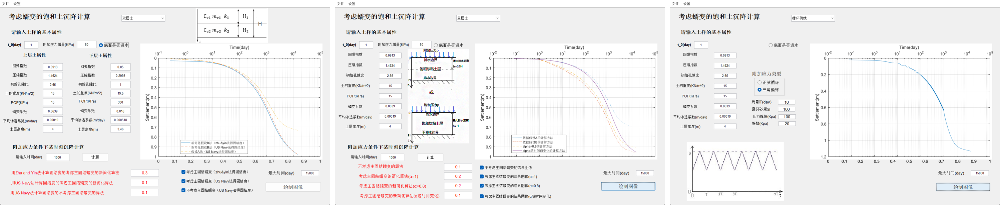
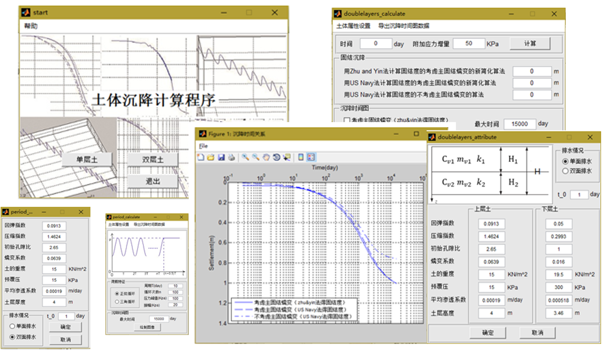
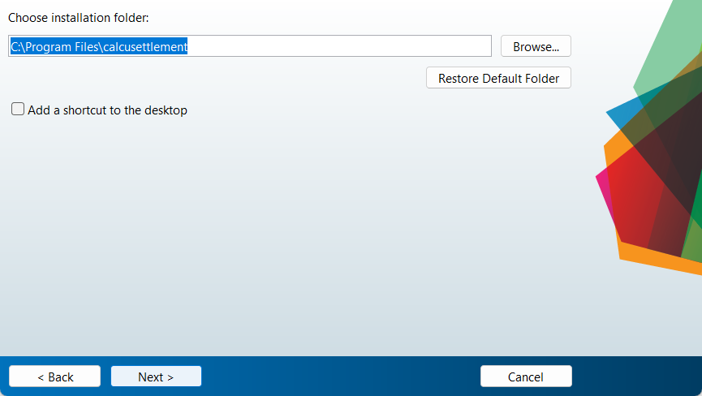

# Calcusettlement: Long-term settlement calculation software for soft clay foundations, accounting for varying creep effects and loading frequencies

I developed this software using MATLAB in 2018, under the supervision of Professor Dongsheng Xu.

At the time, I created two versions of the program: **Calcusettlement v1.0** and **Calcusettlement v2.0**. These programs perform detailed settlement calculations, drawings, image editing, and support image and data exporting.

## Calcusettlement v1.0
This version features a single interface. Its package contains one MATLAB script, `Calcusettlement.m`, which can be executed in MATLAB.

    

## Calcusettlement v2.0
This version includes multiple interfaces and additional features. Its package consists of the following seven MATLAB scripts:

- `onelayer_attribute.m`
- `onelayer_calculate.m`
- `doublelayers_attribute.m`
- `doublelayers_calculate.m`
- `period_attribute.m`
- `period_calculate.m`
- `start.m`

Running `.m` file in MATLAB is dependent on the MATLAB version.

    

## Running the `.exe` file
Running the `.exe` file is independent of the MATLAB version. However, the `Install_Env_To_Run_EXE.exe` file should be executed beforehand. For Calcusettlement v2.0, this file exceeds 100 MB in size. Please download it [here](https://pitt-my.sharepoint.com/:u:/g/personal/doj14_pitt_edu/EaWN2deVhWtJitHFLTmN-PMB1A4z21v2f-HwDiiSV-jILg?e=g57Skz).

    

